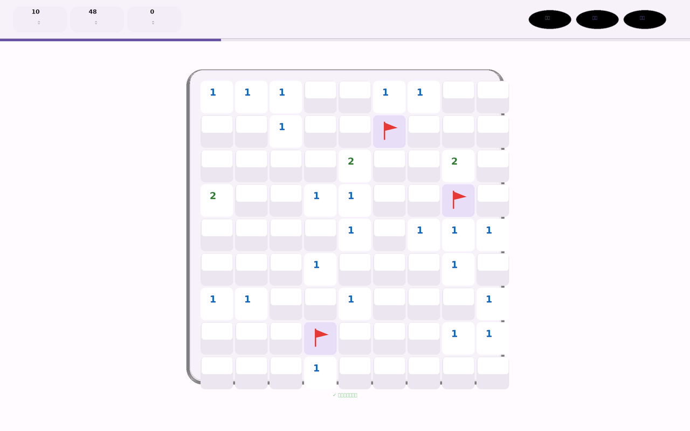

<div align="center">
  
  
  <h1>💣 <span style="background: linear-gradient(135deg, #D0BCFF, #6750A4); -webkit-background-clip: text; color: transparent;">Minesweeper</span></h1>
  
  <p align="center">
    
    
    
    
  </p>

  <p>
    <em>A beautifully crafted single-file Minesweeper with logical No-Guess mode, Material Design 3, and buttery smooth animations.</em>
  </p>

  <div style="margin-top: 25px;">
    <a href="https://cizuwuxin.github.io/minesweeper/">
      
    </a>
  </div>
</div>

<br>

<div align="center">
  <h2>✨ Why this Minesweeper?</h2>
</div>

<table>
  <tr>
    <td align="center" width="25%">
      <b>🧠 No-Guess</b><br>
      <sub>Every puzzle is logically solvable from the first click.</sub>
    </td>
    <td align="center" width="25%">
      <b>🎨 M3 Design</b><br>
      <sub>Smooth surfaces, dynamic color, true dark/light mode.</sub>
    </td>
    <td align="center" width="25%">
      <b>⚡ Zero Latency</b><br>
      <sub>Single file, no frameworks. Instant load, 60fps.</sub>
    </td>
    <td align="center" width="25%">
      <b>📱🖥 Responsive</b><br>
      <sub>Pixel-perfect on any screen size.</sub>
    </td>
  </tr>
</table>

<br>

## 🛠️ Tech Stack

<div align="center">
    
    
    
    
</div>

<br>

## 🚀 Quick Start

```bash
# Just open it
open index.html

# Or deploy anywhere that serves static files
cp index.html /your/server/path/
```

Or visit the **[Live Demo →](https://cizuwuxin.github.io/minesweeper/)**

<br>

## 🎮 Controls

| Action | 🖱 Mouse | 📱 Touch | ⌨ Keyboard |
|:---:|:---:|:---:|:---:|
| **Reveal** | Left Click | Tap | `↑↓←→` + `Enter` |
| **Flag** | Right Click | Long Press | `F` |
| **Chord** | Double-Click | — | `Space` |
| **Undo** | Toolbar | Toolbar | `Ctrl+Z` |
| **New Game** | Toolbar | Toolbar | `R` |

<br>

## 🌟 Features

- 🎨 **Material Design 3** — Smooth surfaces, dynamic color, elegant typography
- 🧠 **No-Guess Mode** — Every puzzle is logically solvable, no luck required
- 🎬 **Custom Difficulty** — Tailor grid size and mine count to your skill
- 🌓 **Theme Toggle** — Seamless dark/light mode switching
- 🔊 **Sound Effects** — Satisfying audio feedback for every action
- 🛡 **First-Click Safety** — Your first reveal is always safe
- ↩ **Undo & Restart** — Recover from mistakes instantly
- 📱 **Fully Responsive** — Pixel-perfect on any screen size

<br>

## 🌍 Languages

<p>
  <a href="./docs/README.en.md">🇬🇧 English</a> •
  <a href="./docs/README.zh-CN.md">🇨🇳 简体中文</a>
</p>

<br>

## 📄 License

Released under the [MIT License](LICENSE).

---

<div align="center">
  <sub>Made with ❤️ by <a href="https://github.com/cizuwuxin">苇林</a></sub>
</div>
